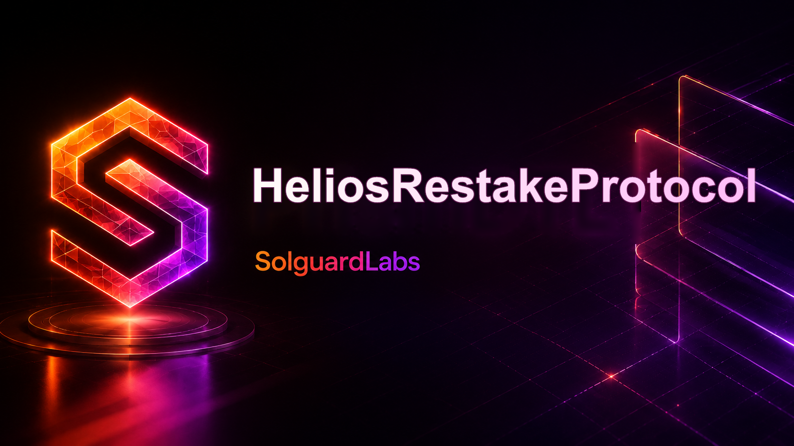

# Helios Restake Protocol



HeliosRestakeProtocol es una implementación Solidity/Foundry de un sistema de
restaking con receipt shares transferibles, delegación a operadores, recompensas
por epoch y cola de retiradas diferidas. Los usuarios depositan un staking token,
reciben `hrsSTK`, delegan exposición operativa y reclaman recompensas distribuidas
por índice.

El repositorio separa custodia, accounting de operadores, delegación,
distribución de rewards, retiradas, slashing, controles de riesgo, comisiones y
vistas de monitorización.

## Arquitectura

```text
                        +----------------+
                        | HeliosAccess   |
                        +-------+--------+
                                |
      +-------------------------+-------------------------+
      |                         |                         |
+-----v------+          +-------v------+          +-------v------+
| Operators  |          | EpochRewards |          | Slashing     |
| registry   |          | reward index |          | controller   |
+-----+------+          +-------+------+          +-------+------+
      |                         |                         |
      +-------------+-----------+-----------+-------------+
                    |                       |
              +-----v-----------------------v-----+
              | HeliosRestakeVault               |
              | deposits, shares, exits, slash    |
              +---+--------------+-----------+----+
                  |              |           |
          +-------v-----+ +------v------+ +--v-----------+
          | Receipt ERC20| | Withdrawal | | ReserveVault |
          | hrsSTK       | | queue      | | penalties    |
          +-------------+ +-------------+ +--------------+
```

## Contratos principales

- `HeliosRestakeVault`: custodia y punto de entrada para stake, delegate,
  undelegate, withdrawal requests, reward claims y slashing callbacks.
- `HeliosReceiptToken`: receipt shares ERC-20 con balances bloqueados para
  retiradas pendientes.
- `OperatorRegistry`: alta de operadores, límites de capacidad y accounting de
  slash/reward.
- `DelegationManager`: tracking de shares delegadas por usuario.
- `WithdrawalQueue`: solicitudes de retirada diferida e historial de requests.
- `EpochRewarder`: funding de epochs y distribución por índice sobre shares
  delegadas.
- `SlashingController`: solicitudes diferidas de slashing con evidence hashes y
  ejecución permissionless cuando están listas.
- `ReserveVault`: almacena staking tokens slashados y reservas del protocolo.
- `RiskController`, `FeeController`, `HeliosAccounting`, `EpochPolicy`: módulos
  operativos de soporte.
- `HeliosLens` y `HeliosMonitor`: lecturas agregadas para dashboards, keepers y
  monitores.

## Flujo operativo

1. Los usuarios depositan staking tokens y reciben `hrsSTK`.
2. Las shares se delegan a operadores registrados dentro de sus límites de
   capacidad.
3. Los rewards se financian por epoch y se distribuyen mediante índices
   acumulados.
4. Las retiradas pasan por una cola con delay antes de ejecutarse.
5. Las solicitudes de slashing siguen una ventana de revisión y ejecución.
6. Las vistas agregadas exponen balances, delegaciones, rewards y estado de
   riesgo.

## Seguridad y controles

- Separación de roles para gobierno, guardianes, operadores de rewards y
  slashing.
- Límites de capacidad por operador.
- Cola de retiradas con locking de receipt shares.
- Slashing diferido con evidence hashes y estado auditable.
- Accounting separado para reservas, penalties y comisiones.
- Pausas operativas y controles de riesgo por módulo.

Consulta [SECURITY.md](./SECURITY.md) para el alcance de revisión y el proceso
de reporte responsable.

## Requisitos

- Foundry (`forge`, `cast`, `anvil`).
- Solidity `0.8.26`.

## Uso local

```bash
forge build
forge test
```

Scripts del proyecto:

```bash
bash scripts/tests.sh
bash scripts/ci.sh
```

Ejecuciones focalizadas:

```bash
forge test --match-path test/Slashing.t.sol -vv
forge test --match-test testEpochRewardsAreDistributedByDelegatedShares -vv
```

## Flujos cubiertos por tests

- depósitos de staking y mint de receipt shares;
- delegación y undelegation de operadores;
- funding, finalización y claim de rewards por epoch;
- solicitud, cancelación y ejecución diferida de retiradas;
- cola, cancelación y ejecución de slashing;
- controles de pausa y snapshots de accounting.

## Despliegue

`script/DeployHelios.s.sol` espera estas variables:

```bash
STAKING_TOKEN=0x...
REWARD_TOKEN=0x...
GOVERNOR=0x...
GUARDIAN=0x...
```

Ejecución:

```bash
forge script script/DeployHelios.s.sol:DeployHelios --rpc-url "$RPC_URL" --broadcast
```
