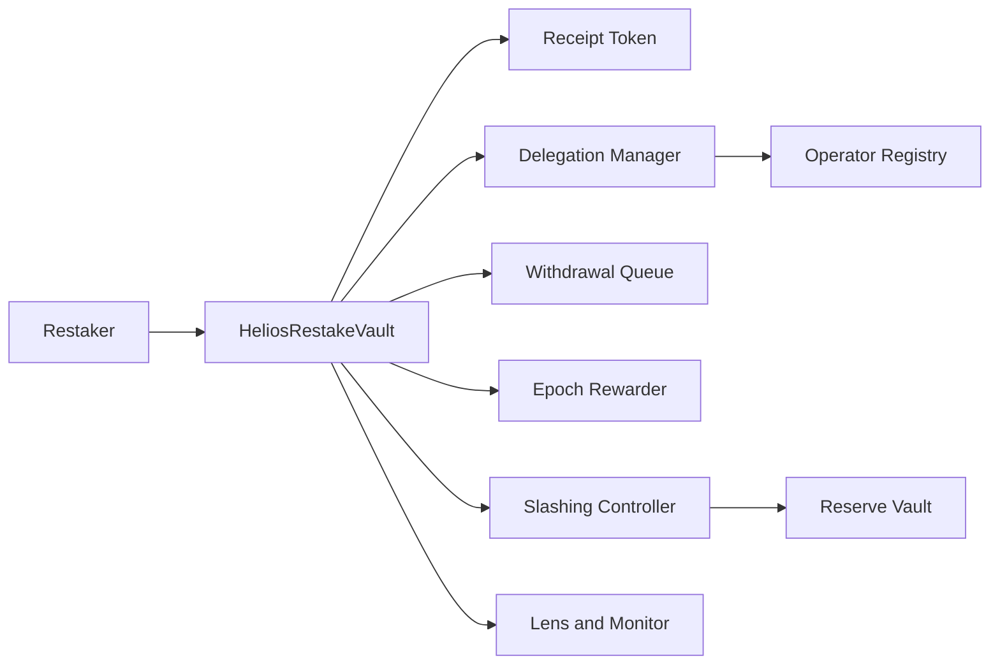
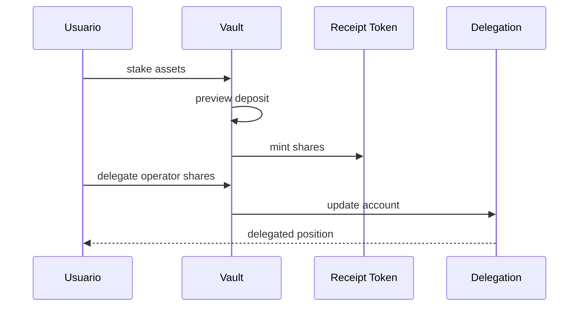
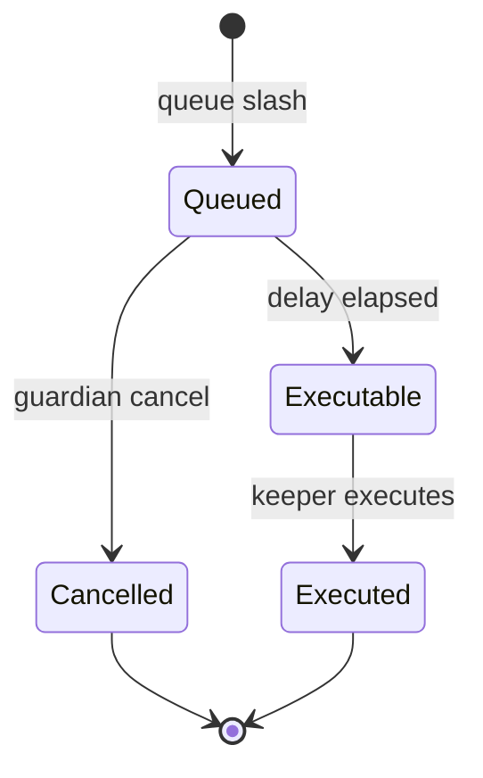
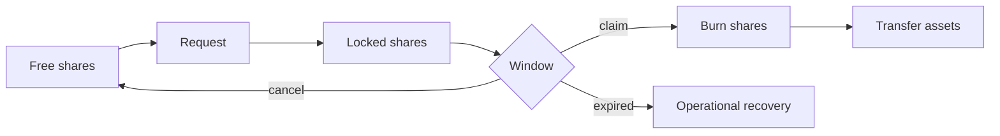

# Helios Restake Protocol

Helios es un protocolo modular de restaking escrito en Solidity 0.8.26. Convierte activos depositados en shares ERC-20, distribuye delegación entre operadores, procesa salidas diferidas, contabiliza recompensas por época y ejecuta slashes con evidencia y demora operativa.

## Arquitectura



| Módulo | Responsabilidad |
| --- | --- |
| `HeliosRestakeVault` | custodia, conversión y coordinación |
| `HeliosReceiptToken` | shares transferibles, bloqueadas y activas |
| `DelegationManager` | posición del usuario y cooldown |
| `OperatorRegistry` | límites, estado y contabilidad por operador |
| `WithdrawalQueue` | solicitudes, ventanas y rondas |
| `EpochRewarder` | financiación e índice por share elegible |
| `SlashingController` | propuesta, evidencia, espera y ejecución |
| `ReserveVault` | activos trasladados por slash |
| `ExitLiquidityStress` | proyección observacional de liquidez |

## Conversión de shares

```text
shares = assets × totalSupply / totalPooledAssets
assets = shares × totalPooledAssets / totalSupply
rateRay = totalPooledAssets × 10²⁷ / totalSupply
```

El primer depósito usa relación 1:1. Después, ganancias y pérdidas modifican el tipo para todas las shares.



## Slashing

Una solicitud incluye operador, BPS, proponente, evidencia y `executableAt`. La demora permite observación y cancelación por gobierno o guardián antes de reducir activos y trasladarlos a la reserva.



## Salidas

Las shares deben estar libres de delegación. La solicitud las bloquea y registra receptor, mínimo, época, instante reclamable y caducidad. La cancelación devuelve disponibilidad; la ejecución quema shares y transfiere activos.



## Modelo de estrés

`ExitLiquidityStress` calcula slash, recorte de liquidez, reserva recuperable, obligación activa y en cola, cobertura, backing activo, tipo proyectado y déficit. Es puro y no puede cambiar el estado del protocolo.

```text
activeLiability = activeShares × pooledAssets / receiptSupply
postShock = (pooledAssets - slashLoss) - liquidityLoss
effectiveAssets = postShock + recoverableReserve
totalLiability = queuedAssets + activeLiability
capitalShortfall = max(totalLiability - effectiveAssets, 0)
```

## Inicio rápido

Requisitos: Foundry estable y Git.

```bash
forge install foundry-rs/forge-std --no-git
forge fmt --check
forge build
forge test
python scripts/verify_release.py
```

## Despliegue

```bash
export STAKING_TOKEN=0x...
export REWARD_TOKEN=0x...
export GOVERNOR=0x...
export GUARDIAN=0x...
forge script script/DeployHelios.s.sol:DeployHelios --rpc-url "$RPC_URL" --broadcast
```

Verifica bytecode, roles, direcciones y parámetros antes de autorizar actividad. El script no almacena claves.

## Calidad

La suite pública contiene pruebas unitarias, fuzzing y escenarios integrados de stake, delegación, recompensas, cola y slashing. La CI compila con Solc 0.8.26 y repite la puerta en Ubuntu y Windows.

## Documentación

- [Arquitectura](docs/arquitectura.md)
- [Contabilidad de shares](docs/contabilidad-shares.md)
- [Delegación y operadores](docs/delegacion-operadores.md)
- [Salidas y liquidez](docs/salidas-liquidez.md)
- [Slashing y reserva](docs/slashing-reserva.md)
- [Operación](docs/operacion.md)
- [Gobernanza](docs/gobernanza.md)
- [Política de seguridad](SECURITY.md)

## Publicación

La rama `production` y la etiqueta anotada `v1.0.0` deben apuntar al mismo commit aprobado en `main`. La versión se publica como `Production 1.0.0` después de superar las matrices independientes.

## Licencia

MIT. Consulta [LICENSE](LICENSE).
