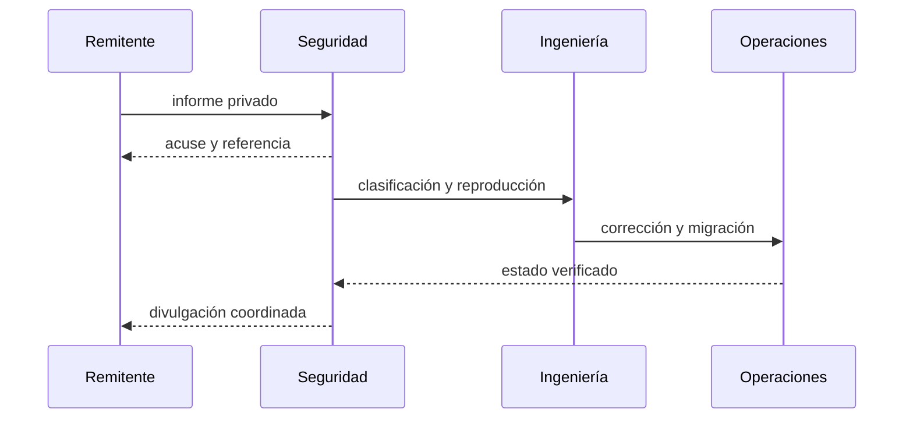
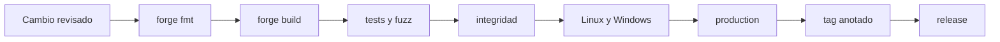

# Política de seguridad

## Versiones mantenidas

| Serie | Estado | Rama |
| --- | --- | --- |
| 1.0.x | Mantenida | `production` |
| anteriores | Sin mantenimiento | — |

## Comunicación responsable

Utiliza **Security → Report a security issue** en GitHub. No publiques detalles sensibles en incidencias, solicitudes o discusiones. Incluye commit, red, contrato, función, precondiciones, impacto económico, reproducción mínima y propuesta de corrección.

Confirmaremos recepción en dos días laborables y entregaremos una clasificación inicial en cinco. La coordinación pública se realiza tras distribuir una corrección y verificar la migración.

## Perímetro

Incluye custodia, conversión de shares, bloqueos, delegación, recompensas, cola, slashing, roles, reserva, librerías matemáticas, despliegue e integridad de artefactos. Las claves y proveedores RPC pertenecen al entorno del operador.

## Publicación segura

`main`, `production` y el commit pelado de la etiqueta deben coincidir. Los cambios de roles, tiempos, límites y BPS requieren revisión separada y simulación de transición.

## Respuesta

Ante una señal confirmada, el guardián aplica la pausa mínima necesaria, preserva bloque y eventos, reconcilia activo, shares, cola y reserva, y documenta reanudación o migración. Una pausa no altera por sí misma derechos históricos.
