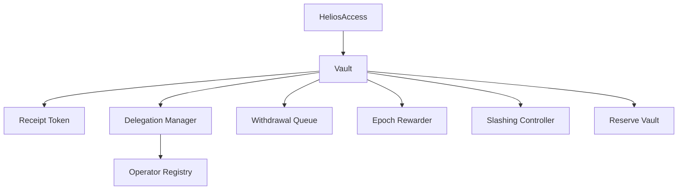
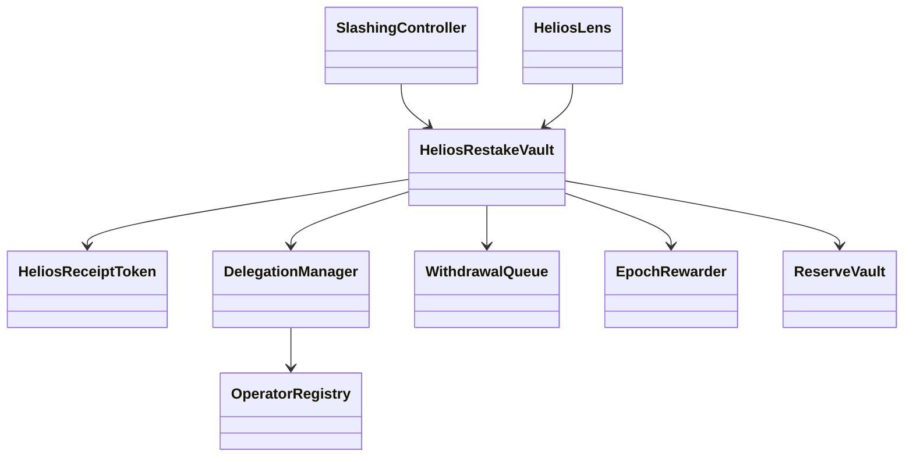
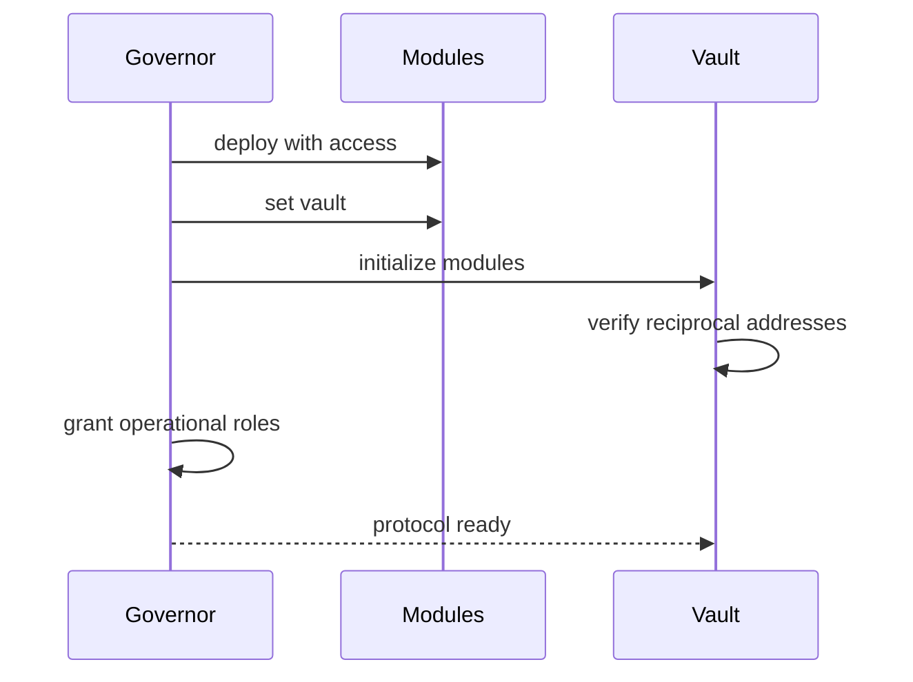

# Arquitectura

## Límites de módulos

El vault coordina movimientos de valor; los módulos especializados mantienen su propio estado y exponen permisos mínimos.

## Autoridad

Sólo el vault acuña o quema receipt shares. Sólo el controlador de slash puede invocar el ajuste de pérdida. Cola, rewarder, reserva y delegación validan la dirección del vault configurada.

## Inicialización

La inicialización es única y rechaza direcciones cero o relaciones inconsistentes. Los contratos principales son inmutables salvo parámetros gobernados explícitos.

## Reentrancia y transferencias

Las rutas de custodia usan guardia de reentrancia y comprueban transferencias ERC-20. El cambio de contabilidad precede o acompaña a la interacción externa de acuerdo con la operación.

## Lecturas

`HeliosLens` agrega vistas para clientes; `HeliosMonitor` emite salud operativa; `HeliosAccounting` construye libros por usuario, operador y época. Ninguno es fuente de custodia.
