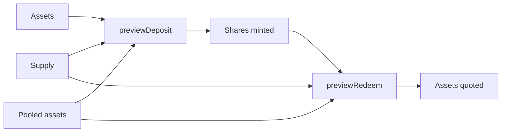
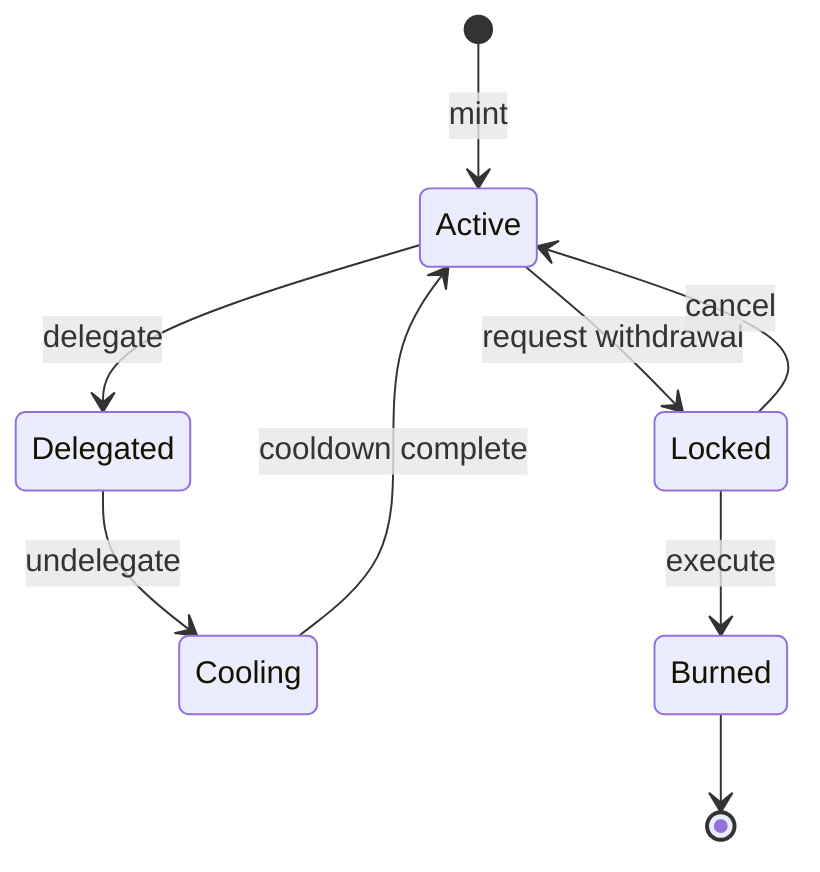
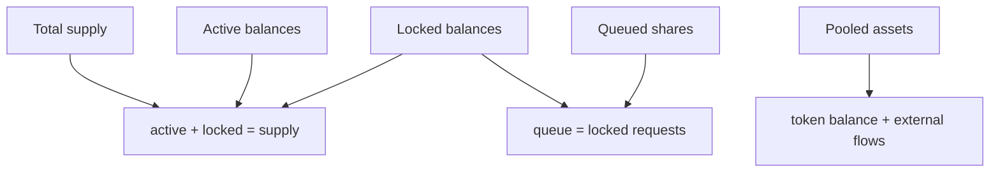

# Contabilidad de shares

## Conversión



Después del primer depósito, la conversión se basa en el cociente entre activos agrupados y supply. La división redondea hacia abajo.

```text
depositShares = assets × supply / pooled
redeemAssets = shares × pooled / supply
exchangeRateRay = pooled × 10²⁷ / supply
```

## Estados de una share



Una share delegada o bloqueada no puede reutilizarse para otra operación. `totalSupply`, `totalLocked` y las cuentas de delegación permiten reconciliar los estados.

## Reconciliación



## Redondeo

Los restos no se asignan al usuario. Las pruebas deben cubrir cantidades pequeñas, supply alto, tipo inferior y superior a uno, y secuencias de depósito y pérdida.

## Snapshot

`VaultSnapshot` publica activos, supply, shares activas, bloqueadas, delegadas y en cola, acumulados y tipo RAY. Se conserva junto al bloque para comparación histórica.
