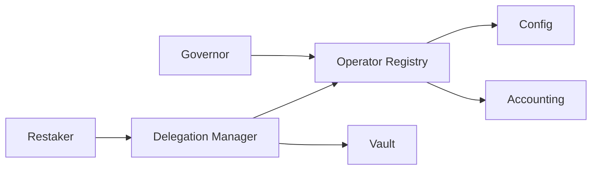
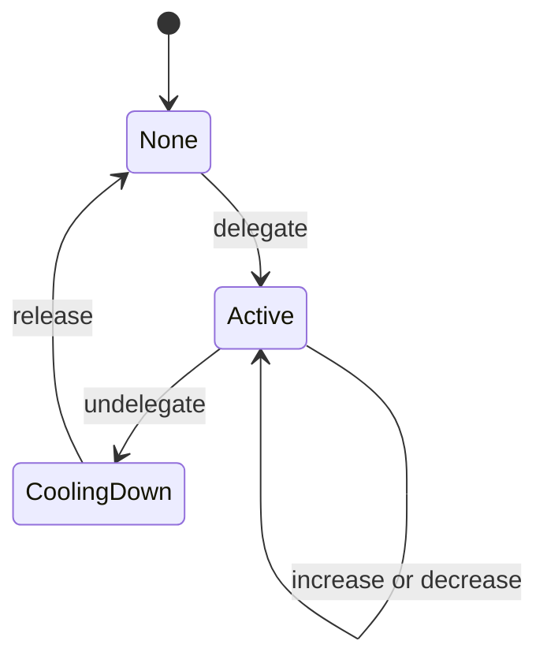
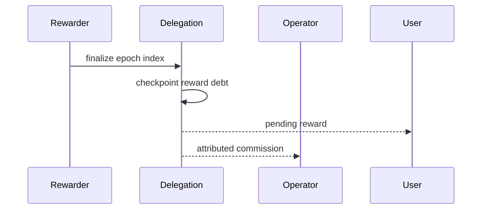

# Delegación y operadores

## Registro

Cada operador tiene controlador, receptor de comisión, límite de shares, estado y hash de metadatos. La contabilidad conserva shares delegadas, salidas en cola, activos, recompensas y slashes acumulados.

## Ciclo

El usuario no puede cambiar de operador mientras mantenga shares delegadas. La capacidad se comprueba antes de actualizar cuenta y agregado.

## Recompensa

## Límites

- sólo operadores activos admiten nuevas delegaciones;
- el límite se mide en shares, no en activos estimados;
- pausa y retiro no borran contabilidad acumulada;
- los metadatos se verifican fuera de cadena antes de mostrarlos.

## Supervisión

Observa concentración por operador, capacidad libre, cooldown pendiente, frecuencia y magnitud de slash y relación entre activos registrados y valor actual de shares delegadas.
