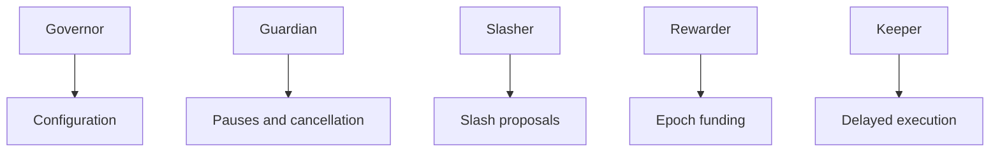
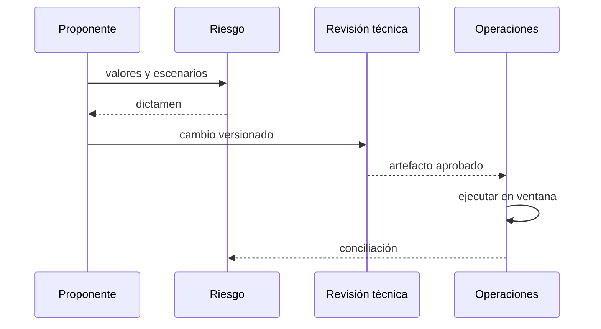
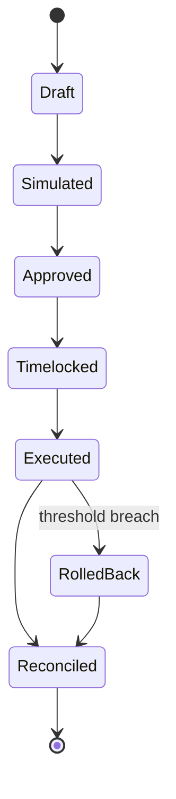

# Gobernanza

## Roles

Las identidades se separan y las claves se custodian fuera del repositorio. El guardián contiene; no puede reconfigurar libremente la economía.

## Cambio de parámetros

Incluye valor anterior y nuevo, unidad, contratos, hipótesis, proyecciones de liquidez, instante efectivo y reversión.

## Parámetros sensibles

- máximos de delegación y comisión;
- demoras de undelegación, retirada y slash;
- máximo de slash;
- duración y presupuesto de épocas;
- límites de riesgo y reserva;
- roles y direcciones de módulos.

## Evidencia

Se conserva propuesta, simulación, aprobaciones, commit, bytecode, transacción, bloque, eventos y conciliación. Los cambios de emergencia reciben revisión retrospectiva y fecha de caducidad.
