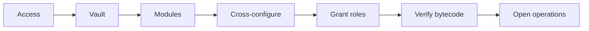
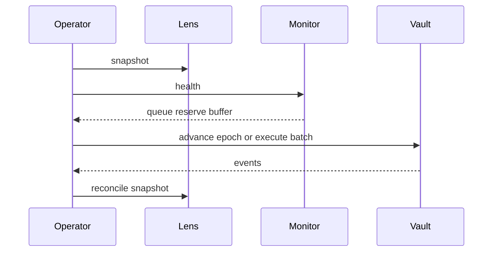
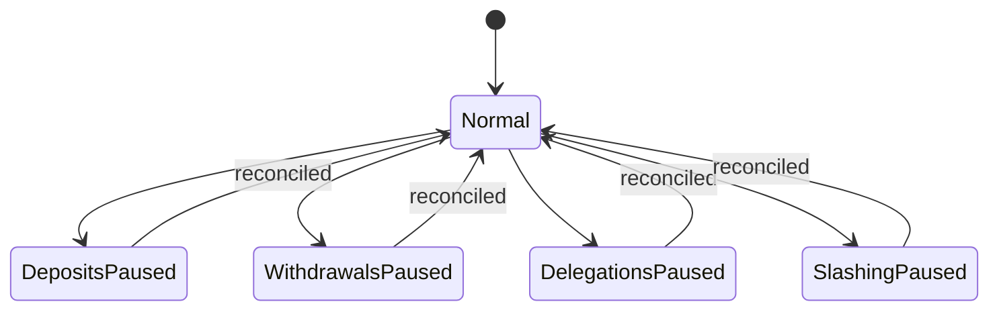

# Operación

## Despliegue

El despliegue valida tokens, gobierno y guardián; configura relaciones recíprocas; otorga roles; y confirma valores de espera y límites antes de recibir activos.

## Rutina

## Pausas

Aplica la pausa mínima que contenga la señal. Una pausa de slashing no debe detener retiros salvo que la liquidez o custodia también estén comprometidas.

## Runbook

1. Fijar bloque y conservar eventos.
2. Leer snapshot, cola, operadores, rewarder y reserva.
3. Ejecutar proyecciones base y adversa.
4. Comparar saldos ERC-20 con libros internos.
5. Decidir pausa, financiación o migración.
6. Reanudar tras doble revisión y conciliación.

## Versiones

Cada entrega conserva commit, compilador, configuración Foundry, hashes de artefactos y resultados de Ubuntu y Windows. Una etiqueta publicada no se mueve.
