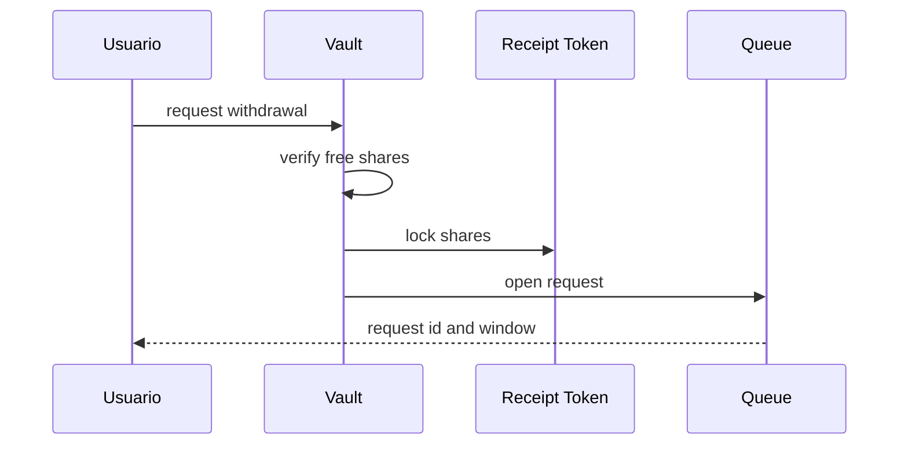
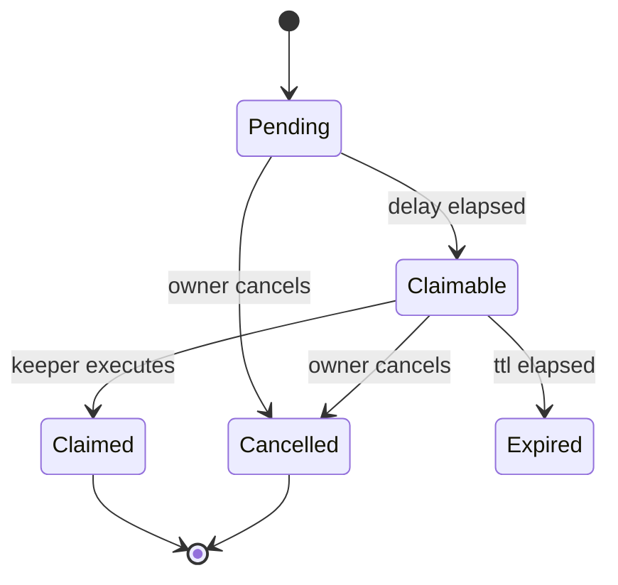
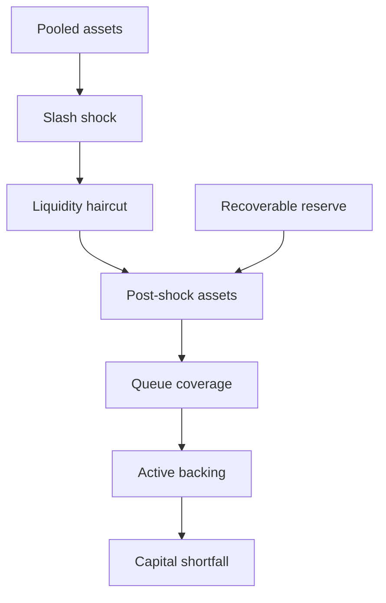

# Salidas y liquidez

## Solicitud

La cola registra propietario, receptor, operador de origen, shares, activos cotizados, mínimo, tiempos, época y estado.

## Ventana

## Proyección de liquidez

`ExitLiquidityStress` asigna primero cobertura a obligaciones en cola y calcula después el respaldo activo. También entrega cobertura global y nivel operativo.

## Escenarios mínimos

| Escenario | Variables |
| --- | --- |
| base | sin slash, reserva disponible |
| operador concentrado | slash alto |
| mercado ilíquido | recorte adicional |
| reserva parcial | recovery inferior al 100 % |
| ola de salidas | queued assets elevados |

## Operación

Antes de ejecutar un lote, compara saldo, activos agrupados, activos en cola, shares bloqueadas, reserva recuperable y proyección. Registra el bloque y los parámetros de estrés usados.
