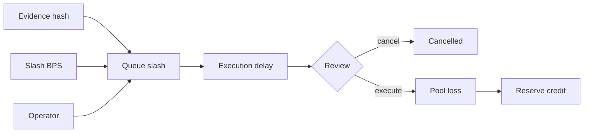
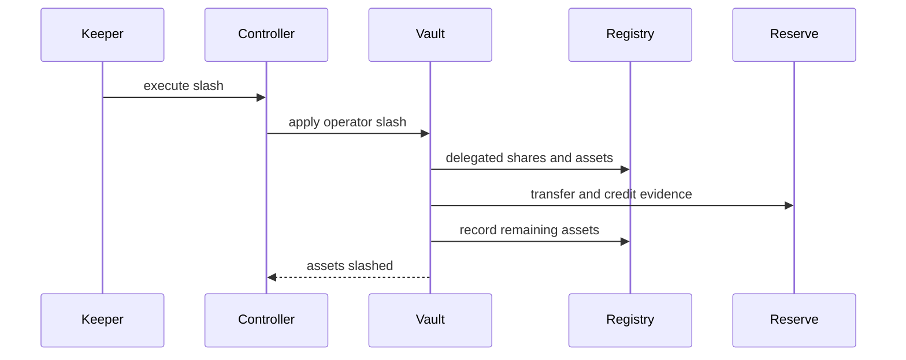
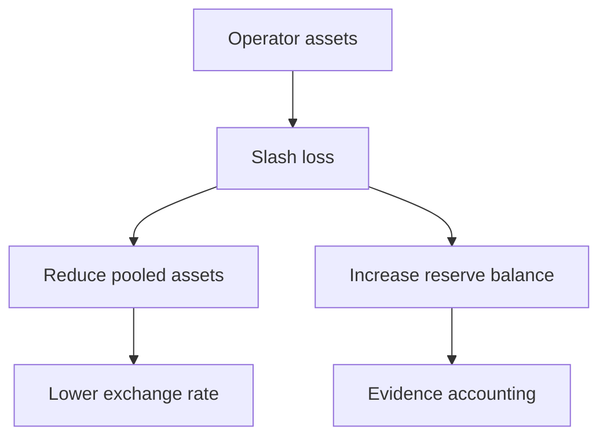

# Slashing y reserva

## Propuesta con evidencia



El BPS debe ser positivo y no superar el máximo. Sólo el rol de slasher o gobierno propone; guardián o gobierno cancela; cualquier ejecutor puede materializar después de la demora si sigue en cola.

## Aplicación



## Cálculo

```text
operatorAssets = delegatedShares × pooledAssets / receiptSupply
assetsSlashed = operatorAssets × slashBps / 10 000
remainingOperatorAssets = operatorAssets - assetsSlashed
```



## Controles

- evidencia no nula;
- estado activo del operador;
- demora entre propuesta y ejecución;
- pausa separada;
- id y estado monotónicos;
- crédito de reserva por operador y evidencia.

## Conciliación

Después de ejecutar, compara salida del vault, entrada a reserva, acumulado global, acumulado del operador, tipo de share y evento. Todas las cifras deben coincidir en la misma transacción.
